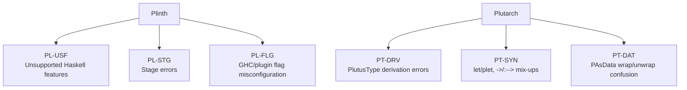

# Six-category error message rig

A second error-collection rig, organised by **failure category** rather
than by individual diagnostic. Each case is a single-file `.patch` that,
applied to a real validator under `src/`, injects a specific bug, and
its sibling `.err` is the captured GHC / Plinth / Plutarch diagnostic.

This rig is independent of `src-errormsg-validators/` — neither rig
overrides or replaces the other, and case names are disjoint.

## Categories

Three Plinth categories and three Plutarch categories, three to seven
patches each.



### Plinth (Plinth-only `.patch` per case)

| Case | Validator | Bug | Expected diagnostic |
|------|-----------|-----|---------------------|
| `PL-USF-01-Voting-GADT` | `Voting/Contracts/VotingPlinth.hs` | Enable `GADTs`, define a witness GADT consumed by `plinthc` | `Unsupported feature: Following extensions are not supported: GADTs` |
| `PL-USF-02-Crowdfund-PolyKinds` | `Crowdfund/Contracts/CrowdfundPlinth.hs` | Enable `PolyKinds`, give `plinthc` code that infers polykinded `Proxy'` | `Unsupported feature: Following extensions are not supported: PolyKinds` |
| `PL-USF-03-Vesting-IntegerLiteralPattern` | `Vesting/Contracts/VestingPlinth.hs` | Rewrite `linearVesting` with `case (timestamp - startTimestamp) of 0 -> 0; elapsed -> ...` — Integer literal pattern | `Unsupported feature: Cannot pattern match on a value of type 'Integer'. ...` |
| `PL-USF-04-Settings-RangeSyntax` | `Settings/Contracts/SettingsPlinth.hs` | Append a `plinthc`-compiled `rangeEntry` that calls `firstInRange n = case [1 .. n] of (x:_) -> x; [] -> 0` — range syntax desugars to `Prelude.enumFromTo` | `Unsupported feature: Use of enumFromTo or enumFromThenTo, possibly via range syntax. Please use PlutusTx.Enum.enumFromTo or PlutusTx.Enum.enumFromThenTo instead.` |
| `PL-USF-05-Crowdfund-Int` | `Crowdfund/Contracts/CrowdfundPlinth.hs` | Append a `plinthc`-compiled `intEntry :: BuiltinData -> Haskell.Int` | `Unsupported feature: Int: use Integer instead` |
| `PL-USF-06-Voting-Double` | `Voting/Contracts/VotingPlinth.hs` | Append a `plinthc`-compiled `doubleEntry :: BuiltinData -> Haskell.Double` returning `quorumThreshold` | `Unsupported feature: Type GHC.Types.Double is not supported in Plinth; use Integer or PlutusTx.Ratio.Rational instead` |
| `PL-USF-07-Vesting-Text` | `Vesting/Contracts/VestingPlinth.hs` | Append a `plinthc`-compiled `textEntry :: BuiltinData -> Text` returning a `Data.Text.Text` label | `Unsupported feature: Type Data.Text.Internal.Text is not supported in Plinth; use BuiltinString instead` |
| `PL-USF-08-Certifying-PreludeGt` | `Certifying/Contracts/CertifyingPlinth.hs` | Append `isPositive n = n Haskell.> 0` — accidentally reaches for `Prelude.>` instead of `PlutusTx.Prelude.>` | `Unsupported feature: GHC.Classes.Ord.>, use PlutusTx.Ord.Class.Ord` |
| `PL-STG-01-Settings-Closure` | `Settings/Contracts/SettingsPlinth.hs` | `mkScaledFee multiplier = plinthc (\fee -> fee * multiplier)` — captures runtime `multiplier` | `... Variable multiplier` stage error |
| `PL-STG-02-Constitution-RuntimeCapture` | `Constitution/Contracts/ConstitutionSortedPlinth.hs` | `mkThresholdValidator threshold = plinthc (\actual -> ... threshold ...)` | `... Variable threshold` stage error |
| `PL-STG-03-Crowdfund-RuntimeCapture` | `Crowdfund/Contracts/CrowdfundPlinth.hs` | `mkBoundedValidator cap = plinthc (\amount -> ... cap ...)` | `... Variable cap` stage error |
| `PL-FLG-01-Vesting-BogusPluginOption` | `Vesting/Contracts/VestingPlinth.hs` | `-fplugin-opt Plinth.Plugin:bogus-option` — unknown key | `PlutusTx.Plugin: failed to parse options: Unrecognised option: "bogus-option"` |
| `PL-FLG-02-Voting-BadTargetVersion` | `Voting/Contracts/VotingPlinth.hs` | `-fplugin-opt Plinth.Plugin:target-version=not.a.version` — wrong value shape for a value-taking option | `Cannot parse value "not.a.version" for option "target-version" into type Int` |
| `PL-FLG-03-Settings-BadInlineGrowth` | `Settings/Contracts/SettingsPlinth.hs` | `-fplugin-opt Plinth.Plugin:inline-callsite-growth=huge` — non-numeric value for an `Int`-typed option | `Cannot parse value "huge" for option "inline-callsite-growth" into type Int` |
| `PL-FLG-04-Constitution-BadDeferErrors` | `Constitution/Contracts/ConstitutionSortedPlinth.hs` | `-fplugin-opt Plinth.Plugin:defer-errors=banana` — value supplied to a boolean-only flag | `Option "defer-errors" is a flag and does not take a value, but was given "banana"` |

Note on PL-FLG. The modern Plinth plugin actively rewrites the dangerous
GHC defaults (`-fignore-interface-pragmas`, `-fomit-interface-pragmas`,
`-ffull-laziness`, `-fspec-constr`, `-fspecialise`, `-fstrictness`,
`-funbox-strict-fields`, `-funbox-small-strict-fields`) in its
`driverPlugin`, and it auto-adds `INLINEABLE` to any binding that
lacks an inline pragma via `addInlineables`. As a result the historical
"forgot `-fno-ignore-interface-pragmas`" failure modes from the
plutus-tx README no longer fire — the plugin compensates. The only
flag-level mistakes that still surface as compile-time errors live
inside the `Plinth.Plugin:*` option namespace, which is what PL-FLG
demonstrates.

### Plutarch (Plutarch-only `.patch` per case)

| Case | Source file | Bug | Expected diagnostic |
|------|-------------|-----|---------------------|
| `PT-DRV-01-Crowdfund-AsDataRecMultiCtor` | `Crowdfund/Types/CrowdfundState.hs` | `DeriveAsDataRec` on multi-constructor `PCrowdfundRedeemer` | `Deriving record encoding only works with types with single constructor. More than one constructor is found.` |
| `PT-DRV-02-Vesting-StructNonData` | `Vesting/Types/VestingState.hs` | `pvdAmount` changed to `Term s PInteger` (non-`PData` inner repr) | `Data representation can only hold types whose inner most representation is PData ... Inner most representation of "PInteger" is "POpaque"` |
| `PT-DRV-03-Vesting-TagNonEnum` | `Vesting/Types/VestingState.hs` | `DeriveAsTag` on `PVestingRedeemer` whose ctor carries `PAsData PInteger` | `DeriveAsTag only supports constructors without arguments. However, at constructor #1, I got: '[Term s (PAsData PInteger)]` |
| `PT-DRV-04-Settings-MissingGenericStock` | `Settings/Types/SettingsState.hs` | Drop `deriving stock (Generic)` from `PSettingsDatum`; `DeriveAsDataStruct` and `SOP.Generic` both need it | `No instance for ‘Generic (PSettingsDatum s1)’ arising from the head of a quantified constraint ... When deriving the instance for (PEq PSettingsDatum)` (and cascading PlutusType/SOP.Generic failures) |
| `PT-DRV-05-Crowdfund-MissingSOPGeneric` | `Crowdfund/Types/CrowdfundState.hs` | Drop `SOP.Generic` from `deriving anyclass` of `PCrowdfundDatum` | `No instance for ‘SOP.Generic (PCrowdfundDatum GHC.Types.Any)’ ... When deriving the instance for (PlutusType PCrowdfundDatum)` |
| `PT-DRV-06-Vesting-NonTermField` | `Vesting/Types/VestingState.hs` | `pvdAmount :: Term s (PAsData PInteger)` changed to `pvdAmount :: Integer` — a non-`Term` field | `Non-term in Plutarch data type not allowed. Got: ‘Integer’ ... When deriving the instance for (PEq PVestingDatum)` |
| `PT-SYN-01-Vesting-LetVsPlet` | `Vesting/Contracts/Vesting.hs` | `inputs <- pletC ...` replaced with `inputs <- plet ...` inside `unTermCont $ do` | `Couldn't match expected type: TermCont s X with actual type: (Term s X -> Term s b0) -> Term s b0` |
| `PT-SYN-02-Voting-ArrowVsPArrow` | `Voting/Contracts/Voting.hs` | `Term s (PData -> PData -> ...)` instead of `Term s (PData :--> PData :--> ...)` | `Expecting one more argument to 'PData' ... has kind 'S -> *'` |
| `PT-SYN-03-Crowdfund-DollarVsHashApp` | `Crowdfund/Contracts/Crowdfund.hs` | `pfix $ plam ...` instead of `pfix #$ plam ...` in `plistLength` | `Couldn't match expected type: Term s1 ((list0 a1 :--> b) :--> (list0 a1 :--> b))` |
| `PT-SYN-04-Vesting-MissingPlam` | `Vesting/Contracts/Vesting.hs` | Drop `plam` from `plinearVesting` — `phoistAcyclic $ \st du tot ts -> ...` (raw Haskell lambda where Plutarch HOAS is needed) | `Couldn't match expected type 'Term s' (PInteger :--> ...)' with actual type 'Term s0 PInteger -> Term s0 PInteger -> ...' — has four value arguments, but its type ... has none` |
| `PT-SYN-05-SmartTokens-PlainDoVsPDot` | `SmartTokens/Contracts/ProgrammableLogicBase.hs` | Replace `P.do` (the `Plutarch.Monadic` QualifiedDo block) in `mkProgrammableLogicGlobal` with plain `do` | `Couldn't match type 'Term s (PBuiltinList (PAsData PTxInInfo))' with 'PScriptContext s' ... In a stmt of a 'do' block: PScriptContext{...} <- pmatch ctx` |
| `PT-SYN-06-Voting-EqVsHashEq` | `Voting/Contracts/Voting.hs` | `pfstBuiltin # pair #== csData` → `pfstBuiltin # pair == csData` in `pfindCSEntry` | `Couldn't match expected type 'Term s' PBool' with actual type 'Bool'` |
| `PT-SYN-07-Crowdfund-OrdVsHashGeq` | `Crowdfund/Contracts/Crowdfund.hs` | `contractAmount #>= goal` → `contractAmount >= goal` in `pcheckWithdraw` | `Couldn't match expected type 'Term s' PBool' with actual type 'Bool' — In the second argument of '(#&&)', namely 'contractAmount >= goal'` |
| `PT-DAT-01-Vesting-MissingPFromData` | `Vesting/Contracts/Vesting.hs` | `let beneficiary = pvdBeneficiary` (forgot `pfromData`) | `Couldn't match type 'PAsData PPubKeyHash' with 'PPubKeyHash'` |
| `PT-DAT-02-Crowdfund-MissingPData` | `Crowdfund/Contracts/Crowdfund.hs` | `outWallets #== (pfilterOutKey # currentSigner # wallets)` (forgot `pdata`) | `Couldn't match type: PMap Unsorted PPubKeyHash PInteger with: PAsData (PMap Unsorted PPubKeyHash PInteger)` |
| `PT-DAT-03-Constitution-MissingPData` | `Constitution/Contracts/ConstitutionSorted.hs` | Drop the `pdata` around `pproposalProcedure'governanceAction` before `pforgetData` | `Couldn't match type 'PGovernanceAction' with 'PAsData a0'` |
| `PT-DAT-04-Crowdfund-DoublePFromData` | `Crowdfund/Contracts/Crowdfund.hs` | `# pfromData pdonateDonor` → `# pfromData (pfromData pdonateDonor)` — apply `pfromData` twice | `Couldn't match type 'PPubKeyHash' with 'PAsData PPubKeyHash' — Expected: Term s' (PAsData (PAsData PPubKeyHash))` |

## Layout

```
src-errormsg-categories/
  PL-USF-01-Voting-GADT/
    Plinth.patch       # unified diff with '# source:' header
    Plinth.hs          # generated: cp <source> + patch
    Plinth.err         # captured GHC / Plinth diagnostic
  ...
  PT-DAT-03-Hydra-PIntForPAsData/
    Plutarch.patch
    Plutarch.hs
    Plutarch.err
  run.sh
  README.md
```

Per case the `.hs` file is a **generated** copy of the upstream
validator (or types module) with the patch applied. The `.err` file
is the filtered GHC diagnostic. The `.patch` file is the source of
truth — the `# source:` header at the top tells `run.sh` which file
under `src/` to copy before applying the diff.

## Workflow

```bash
nix develop                                  # provides GHC + cabal + project deps
src-errormsg-categories/run.sh               # generate + compile + collect, every case
src-errormsg-categories/run.sh PL-STG        # restrict to one prefix
src-errormsg-categories/run.sh PT-DRV-01     # restrict to one case
```

`run.sh` is the only script in this directory. For every
`<case>/<variant>.patch` (variant = `Plinth` or `Plutarch`) it:

1. Reads the `# source:` header from the patch.
2. Copies that upstream file from `src/` to `<case>/<variant>.hs`.
3. Applies the diff with `patch -p1`.
4. Compiles the result with
   `cabal exec ghc -- -Wall -fforce-recomp -ferror-spans -c
   -package plinth-plutarch-paper-code` plus the project's
   default-extensions, capturing stdout+stderr.
5. Strips the cabal/nix preamble and the SGR escapes Plinth emits
   around its caret underlines, then writes the result to
   `<case>/<variant>.err`.

Per-case verdict printed on stdout:

* `errors captured`        — GHC failed (expected for every case here).
* `warnings captured`      — GHC succeeded but emitted warnings.
* `clean (no diagnostics)` — the bug didn't fire (regression).

## Adding a new case

1. Pick a target validator under `src/` whose shape supports the bug
   you want to demonstrate.
2. Hand-edit a copy of that file to inject the bug.
3. Generate the patch with
   `diff -u src/<path> /tmp/<modified> | sed 's|^--- .*|--- a/<Variant>.hs|; s|^+++ .*|+++ b/<Variant>.hs|'`.
4. Prepend a `# source:` line pointing at the upstream file, plus any
   explanatory header comments (every line that should be ignored by
   `patch` must start with `#`).
5. `src-errormsg-categories/run.sh <case-prefix>` to verify the
   diagnostic.
